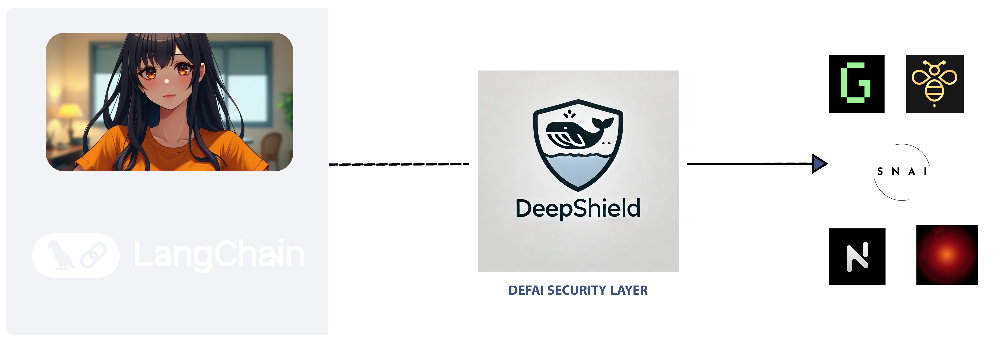

# DeepShield Core

[](https://deepseek.gitbook.io/deepshield)
[](https://github.com/DeepShield/deepshield-core/blob/main/LICENSE)



DeepShield Core is a comprehensive AI-powered security framework for DeFi agents and smart contracts. It provides real-time protection against various attack vectors and vulnerabilities in the DeFi ecosystem.

## Features

- AI-powered transaction analysis for detecting:
  - Sandwich attacks
  - Flash loan attacks
  - Price manipulation
  - Suspicious patterns
- Smart contract vulnerability scanning:
  - Known vulnerability pattern detection
  - AI-based control flow analysis
  - Unsafe external call detection
  - Reentrancy protection
- Real-time monitoring and protection:
  - Mempool monitoring
  - Emergency shutdown capabilities
  - Automated threat response

## Components

### AI Agent Analyzer
The AI agent analyzer uses DeepSeek LLM to perform advanced security analysis:
- Prompt injection vulnerability detection
- Output validation verification
- Rate limiting checks
- Model access control validation
- Data privacy assessment
- Cost control mechanism verification

### Transaction Analyzer
Monitors and protects against:
- MEV attacks
- Sandwich attacks
- Flash loan exploits
- Price manipulation

### Bridge Monitor
Provides cross-chain security through:
- Bridge activity monitoring
- Liquidity validation
- Message verification
- Replay attack prevention

### Oracle Validator
Ensures price feed integrity:
- Price manipulation detection
- Data freshness verification
- Deviation monitoring
- Multi-source validation

## Installation

Add this to your `Cargo.toml`:
```toml
[dependencies]
deepshield-core = "0.1.0"
```

## Environment Setup

Create a `.env` file with the following variables:

```env
ETHEREUM_RPC_URL=http://localhost:8545
SOLANA_RPC_URL=http://localhost:8899
DEEPSEEK_API_KEY=your_api_key
```

## Quick Start

```rust
use deepshield_core::SecurityFramework;
#[tokio::main]
async fn main() {
// Initialize the security framework
let framework = SecurityFramework::new().await;
// Analyze a smart contract
let report = framework.analyze_contract("0x...").await.unwrap();
// Start monitoring
framework.start_monitoring().await;
// Set up emergency protocols
framework.initialize_emergency_protocols().await;
}
```

## Components

### AI Agent Analyzer
The AI agent analyzer uses DeepSeek LLM to perform advanced security analysis:
- Prompt injection vulnerability detection
- Output validation verification
- Rate limiting checks
- Model access control validation
- Data privacy assessment
- Cost control mechanism verification

### Transaction Analyzer
Monitors and protects against:
- MEV attacks
- Sandwich attacks
- Flash loan exploits
- Price manipulation

### Bridge Monitor
Provides cross-chain security through:
- Bridge activity monitoring
- Liquidity validation
- Message verification
- Replay attack prevention

### Oracle Validator
Ensures price feed integrity:
- Price manipulation detection
- Data freshness verification
- Deviation monitoring
- Multi-source validation

## Contributing

1. Fork the repository
2. Create your feature branch (`git checkout -b feature/amazing-feature`)
3. Commit your changes (`git commit -m 'Add amazing feature'`)
4. Push to the branch (`git push origin feature/amazing-feature`)
5. Open a Pull Request

## License

This project is licensed under the MIT License - see the LICENSE file for details.

## Security

For security concerns, please email security@deepshield.io

## Documentation

For detailed documentation, visit [docs.deepshield.io](https://deepseek.gitbook.io/deepshield)